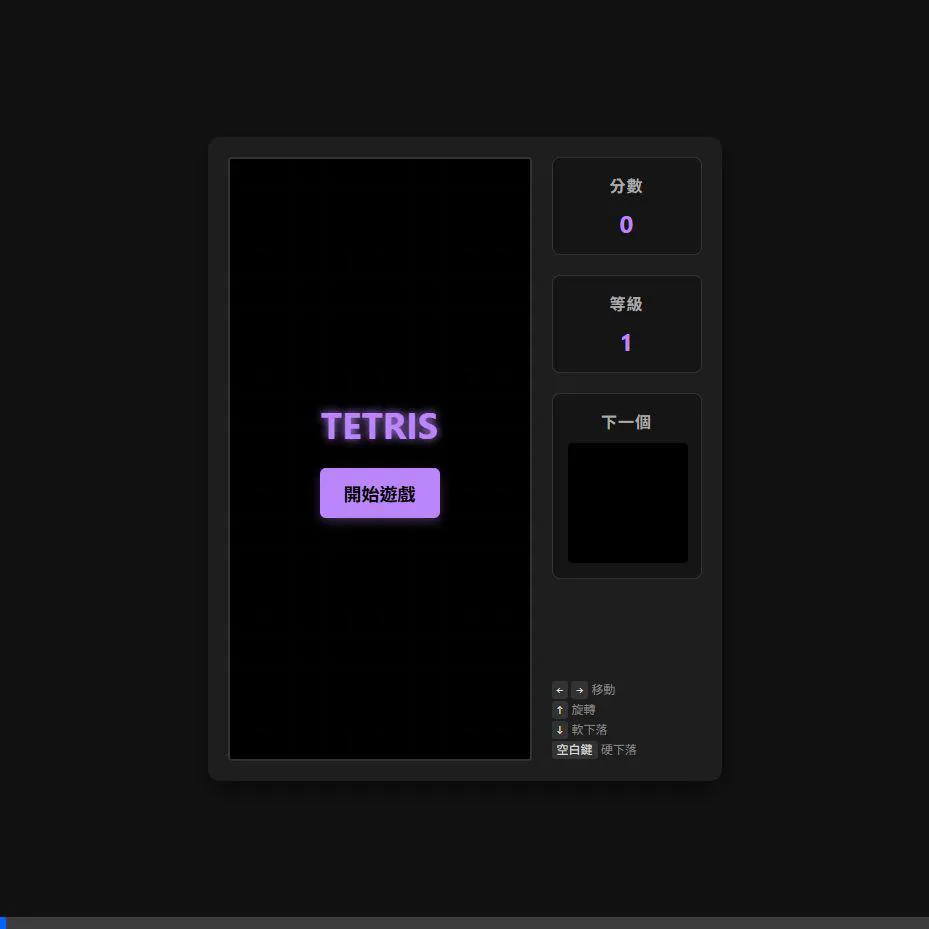

# 俄羅斯方塊實作總結

我們已經成功完成了一款純 HTML 的俄羅斯方塊遊戲。

## 變更摘要

建立了一個獨立的 HTML 檔案，包含：
- **Canvas 畫布渲染**：用於主遊戲區域與「下一個方塊」的預覽。
- **Modern UI**：使用深色背景、微發光的陰影、與霓虹燈質感的字體顏色，介面清爽美觀。
- **Web Audio API**：實作了五種不同的音效 (移動、旋轉、下落、消除、遊戲結束)，完全不需依賴外部的 `.mp3` 或 `.wav` 檔案。
- **完整操作支援**：包含左右移動、加速下落、硬下落 (空白鍵)、左右旋轉。

## 測試影片展示

以下為 Agent 自動遊玩與測試功能的實際錄影畫面：

## 實作檔案

- [NEW] [index.html](./index.html)

## 如何測試與遊玩

請使用任何現代瀏覽器 (例如 Chrome、Edge、Firefox) 開啟上述的 `index.html` 檔案。
1. 點擊畫面中央的 **「開始遊戲」** 按鈕（這會同時啟動瀏覽器的音訊系統）。
2. 使用鍵盤的 **方向鍵** 控制方塊移動與旋轉。
3. 按下 **空白鍵** 可以讓方塊直接掉落到底部。
4. 試著填滿整行，驗證消除功能與音效是否正常。

如果有任何問題或希望調整手感（例如下落速度、旋轉邏輯），請隨時告訴我！
